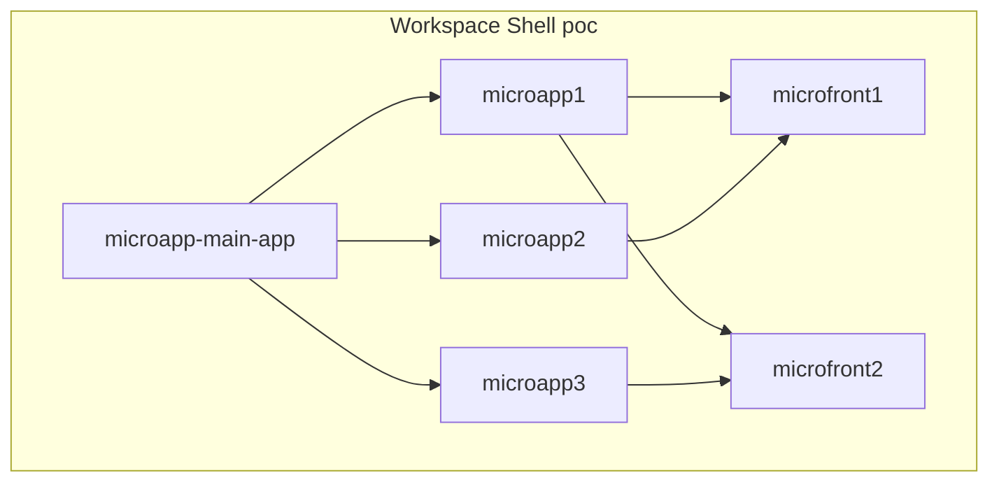
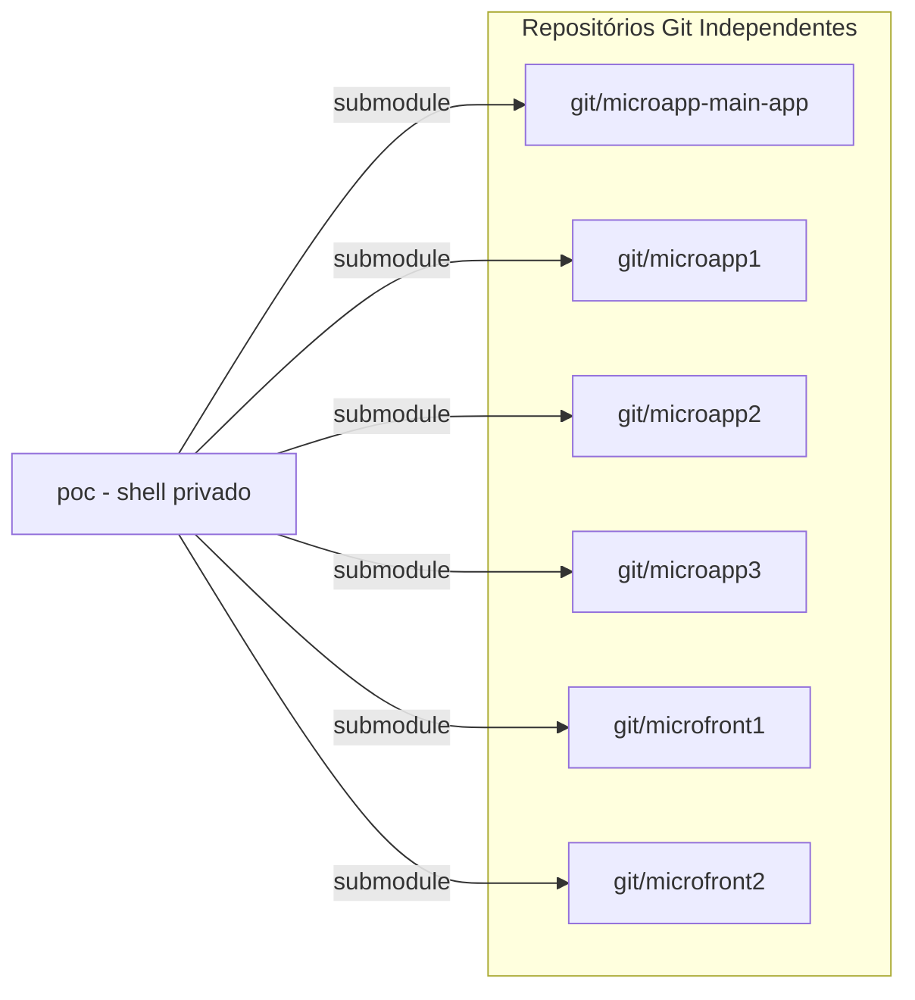

# Documentação de Implementação — Sistema Microapps React Native

Sistema baseado em **react-native-builder-bob**, com multi-repo (git separado por pacote) e desenvolvimento local via **Yarn Workspaces**, sem `node_modules` recursivo.

---

## 1. Visão geral / objetivo

| Papel | Relação | Exemplo neste POC |
|---|---|---|
| **Main App** | 1 mainapp → N microapps | `microapp-main-app` |
| **Microapp** | 1 microapp → N microfronts | `microapp1`, `microapp2`, `microapp3` |
| **Microfront** | Lib UI/feature consumida pelo microapp | `microfront1`, `microfront2` |

**Objetivos:**

1. Cada microapp e cada microfront vive em **repositório git próprio** (publicação independente).
2. O `microapp-main-app` é o app React Native que orquestra os microapps.
3. Em desenvolvimento local, o workspace shell (`poc`) agrega tudo e exige **apenas um** `yarn` na raiz + `yarn start` no mainapp — **sem** `yarn install` dentro de cada pasta.
4. Build das libs com **react-native-builder-bob** (`bob build` no `prepare`/`prepack`).

---

## 2. Diagrama da hierarquia





---

## 3. Estratégia de repositórios (multi-repo + submodules)

Cada pasta (`microapp-main-app`, `microapp*`, `microfront*`) é um **repositório git independente**. A raiz `poc` é um **shell privado** (não publicado) que agrega os remotes via **git submodules**.

### 3.1 Exemplo de `.gitmodules`

```ini
[submodule "microapp-main-app"]
  path = microapp-main-app
  url = git@github.com:org/microapp-main-app.git

[submodule "microapp1"]
  path = microapp1
  url = git@github.com:org/microapp1.git

[submodule "microapp2"]
  path = microapp2
  url = git@github.com:org/microapp2.git

[submodule "microapp3"]
  path = microapp3
  url = git@github.com:org/microapp3.git

[submodule "microfront1"]
  path = microfront1
  url = git@github.com:org/microfront1.git

[submodule "microfront2"]
  path = microfront2
  url = git@github.com:org/microfront2.git
```

### 3.2 Comandos de setup

```bash
# Criar o shell e adicionar os submodules (primeira vez)
git init
git submodule add git@github.com:org/microapp-main-app.git microapp-main-app
git submodule add git@github.com:org/microapp1.git microapp1
git submodule add git@github.com:org/microapp2.git microapp2
git submodule add git@github.com:org/microapp3.git microapp3
git submodule add git@github.com:org/microfront1.git microfront1
git submodule add git@github.com:org/microfront2.git microfront2

# Clone posterior do shell (já com .gitmodules)
git clone --recurse-submodules git@github.com:org/poc-shell.git
# ou, se já clonou sem submodules:
git submodule update --init --recursive
```

---

## 4. Estrutura de pastas final

```text
poc/                              # workspace shell (privado)
├── package.json                  # workspaces + private: true
├── yarn.lock
├── .yarnrc.yml                   # se Yarn Berry
├── .gitmodules
├── IMPLEMENTACAO.md
├── node_modules/                 # ÚNICO node_modules (hoisted)
│
├── microapp-main-app/            # repo git próprio — app RN
│   ├── package.json
│   ├── metro.config.js
│   ├── src/
│   ├── ios/
│   └── android/
│
├── microapp1/                    # repo git próprio — lib bob
│   ├── package.json
│   ├── src/
│   └── lib/                      # gerado por bob build
│
├── microapp2/
├── microapp3/
├── microfront1/
└── microfront2/
```

**Regra:** nenhum pacote filho tem `node_modules` próprio em desenvolvimento. Dependências sobem para `poc/node_modules`.

---

## 5. Yarn Workspaces na raiz

A raiz `poc` agrega todos os packages. Ela **não é publicada** (`"private": true`).

### 5.1 `package.json` (raiz)

```json
{
  "name": "poc-shell",
  "private": true,
  "workspaces": [
    "microapp-main-app",
    "microapp1",
    "microapp2",
    "microapp3",
    "microfront1",
    "microfront2"
  ],
  "resolutions": {
    "react": "19.0.0",
    "react-native": "0.78.0"
  },
  "scripts": {
    "start": "yarn workspace microapp-main-app start",
    "android": "yarn workspace microapp-main-app android",
    "ios": "yarn workspace microapp-main-app ios"
  }
}
```

> Ajuste as versões em `resolutions` para o par `react` / `react-native` usado pelo mainapp. Isso evita duplicatas no Metro.

### 5.2 Yarn Classic (v1)

```bash
# raiz
yarn install
```

Workspaces usam `link:` ou o protocolo implícito do Yarn Classic para pacotes locais listados em `workspaces`.

### 5.3 Yarn Berry (v2+)

Arquivo `.yarnrc.yml` na raiz:

```yaml
nodeLinker: node-modules
nmHoistingLimits: workspaces
```

`nmHoistingLimits: workspaces` evita subir dependências do app de forma perigosa e reduz risco de módulos duplicados no React Native. Use `workspace:*` nas dependências locais.

---

## 6. Scaffolding com create-react-native-library (bob)

Cada `microapp*` e cada `microfront*` é uma biblioteca React Native gerada/alinada com bob.

### 6.1 Gerar uma lib local

Na **raiz do workspace** (ou dentro da pasta do destino, conforme o fluxo do CLI):

```bash
npx create-react-native-library@latest microfront1 --local
```

O flag `--local` gera uma lib pensada para monorepo/workspace (sem boilerplate de example app desnecessário) e já vem com **react-native-builder-bob** pré-configurado.

Repita para `microfront2`, `microapp1`, `microapp2`, `microapp3`, etc.

### 6.2 Estrutura típica de uma lib

```text
microfront1/
├── package.json
├── src/
│   ├── index.tsx
│   └── ...
├── lib/                 # output do bob (não editar à mão)
└── tsconfig.json
```

### 6.2.1 Arquitetura interna obrigatória de cada microapp

Cada `microapp*-rn` segue camadas com dependência unidirecional (referência: módulo de eleições):

```text
entities → services → repositories → hooks → ui/screens → ui/components
```

```text
microappN-rn/
├── .eslintrc.js              # restringe imports entre camadas
├── package.json
├── src/
│   ├── entities/             # tipos; export via index.ts (barrel)
│   ├── services/             # transporte cru (HTTP/mock)
│   ├── repositories/         # normalização + orquestra service
│   ├── hooks/                # estado + efeitos (só repository)
│   ├── utils/                # funções puras
│   ├── ui/
│   │   ├── screens/
│   │   ├── components/
│   │   ├── styles/
│   │   └── navigation/       # opcional
│   └── index.tsx             # API pública
└── lib/
```

**Diretrizes de hooks**

| Regra | Detalhe |
|---|---|
| Uma responsabilidade | `use-<domínio>-<ação>.ts` (ex.: `use-pedidos-lista`) |
| Sem service direto | hooks → repositories → services |
| Efeitos na camada certa | `useEffect` de dados no hook; screens não fazem fetch |
| Race async | flag `ativo` ou `AbortController` |
| Hub compartilhado | Context Provider quando N screens usam o mesmo estado composto |
| Barrel de entities | importar de `../entities`, nunca `*_entity.ts` |

Exemplos no POC: pedidos (`microapp1-rn`), métricas (`microapp2-rn`), contador (`microapp3-rn`).

### 6.3 `package.json` da lib (exemplo — microfront)

```json
{
  "name": "microfront1",
  "version": "0.1.0",
  "main": "lib/commonjs/index.js",
  "module": "lib/module/index.js",
  "types": "lib/typescript/src/index.d.ts",
  "react-native": "src/index.tsx",
  "source": "src/index.tsx",
  "files": [
    "src",
    "lib",
    "!**/__tests__"
  ],
  "scripts": {
    "prepare": "bob build",
    "typecheck": "tsc --noEmit"
  },
  "peerDependencies": {
    "react": "*",
    "react-native": "*"
  },
  "devDependencies": {
    "react-native-builder-bob": "^0.40.0",
    "typescript": "^5.0.0"
  },
  "react-native-builder-bob": {
    "source": "src",
    "output": "lib",
    "targets": [
      "commonjs",
      "module",
      "typescript"
    ]
  }
}
```

### 6.4 `package.json` do microapp (depende de microfronts)

```json
{
  "name": "microapp1",
  "version": "0.1.0",
  "main": "lib/commonjs/index.js",
  "module": "lib/module/index.js",
  "types": "lib/typescript/src/index.d.ts",
  "react-native": "src/index.tsx",
  "source": "src/index.tsx",
  "scripts": {
    "prepare": "bob build"
  },
  "dependencies": {
    "microfront1": "workspace:*",
    "microfront2": "workspace:*"
  },
  "peerDependencies": {
    "react": "*",
    "react-native": "*"
  },
  "devDependencies": {
    "react-native-builder-bob": "^0.40.0"
  },
  "react-native-builder-bob": {
    "source": "src",
    "output": "lib",
    "targets": ["commonjs", "module", "typescript"]
  }
}
```

> Yarn Classic: troque `"workspace:*"` por `"link:../microfront1"` (ou `"*"` se o nome estiver no `workspaces` e o Yarn resolver localmente).

### 6.5 `package.json` do mainapp (depende dos microapps)

```json
{
  "name": "microapp-main-app",
  "version": "0.0.1",
  "private": true,
  "scripts": {
    "start": "react-native start",
    "android": "react-native run-android",
    "ios": "react-native run-ios"
  },
  "dependencies": {
    "react": "19.0.0",
    "react-native": "0.78.0",
    "microapp1": "workspace:*",
    "microapp2": "workspace:*",
    "microapp3": "workspace:*"
  },
  "devDependencies": {
    "@react-native/metro-config": "*",
    "react-native-monorepo-config": "^0.3.3"
  }
}
```

---

## 7. Sem `node_modules` recursivo

### 7.1 Como funciona

1. Um único `yarn install` na raiz lê todos os `package.json` dos workspaces.
2. Dependências comuns (`react`, `react-native`, etc.) sobem para `poc/node_modules`.
3. Pacotes locais (`microapp1`, `microfront1`, …) viram **symlink** em `node_modules/<nome>`.
4. Não execute `yarn` / `npm install` dentro de `microapp*` nem `microfront*` no dia a dia.

### 7.2 `resolutions` (alinhar React)

```json
{
  "resolutions": {
    "react": "19.0.0",
    "react-native": "0.78.0"
  }
}
```

Isso força uma única versão no grafo e evita o erro clássico de “Invalid hook call” / múltiplos React no Metro.

### 7.3 O que **não** fazer

- ❌ `cd microapp1 && yarn install`
- ❌ `node_modules` commitado em cada pacote
- ❌ publicar e reinstalar via npm registry só para desenvolver (use `workspace:*` / symlink local)

---

## 8. Metro config (`react-native-monorepo-config`)

A partir do **react-native-builder-bob >= 0.43**, o helper `react-native-builder-bob/metro-config` foi **removido**. Use o pacote **`react-native-monorepo-config`**.

Arquivo: `microapp-main-app/metro.config.js`

```js
const path = require('path');
const { getDefaultConfig } = require('@react-native/metro-config');
const { withMetroConfig } = require('react-native-monorepo-config');

const dirname = __dirname;

module.exports = withMetroConfig(getDefaultConfig(dirname), {
  root: path.resolve(dirname, '..'),
  dirname: dirname,
  workspaces: [
    'microapp1',
    'microapp2',
    'microapp3',
    'microfront1',
    'microfront2',
  ],
});
```

Isso faz o Metro:

- observar a raiz do workspace (`watchFolders`);
- resolver source dos pacotes locais (sem exigir rebuild contínuo em alguns fluxos);
- evitar inconsistências de `node_modules` aninhados.

---

## 9. Fluxo de desenvolvimento dia a dia (Melos-like)

O shell expõe uma DX equivalente ao Melos via `microapps.yaml` + `scripts/microapps.js`.

| Melos | Comando neste POC |
|-------|-------------------|
| `melos bootstrap` | `yarn bootstrap` |
| path/local deps | `yarn point-local` |
| `melos list` | `yarn microapps list [--scope …]` |
| `melos exec -- …` | `yarn microapps run <script> --scope …` |
| run example/app | `yarn start` |

```bash
# 1) Clonar shell + packages
git clone --recurse-submodules <url-do-shell>
cd poc

# 2) Bootstrap (submodules + yarn raiz + point-local + validate)
yarn bootstrap

# 3) Desenvolver
yarn start
```

Edição de código:

- Altere `microfront1-rn/src/...` → Metro recarrega via symlink.
- Altere `microapp2-rn/src/...` → idem.
- **Não** rode `yarn` de novo em cada pasta após mudanças de código (só `yarn` / `yarn bootstrap` na raiz quando mexer em dependências).

### 9.1 Point-local

`microapps.yaml#graph` define o apontamento local:

```yaml
graph:
  microapp-main-app-rn: [microapp1-rn, microapp2-rn, microapp3-rn]
  microapp1-rn: [microfront1-rn, microfront2-rn]
  microapp2-rn: [microfront1-rn]
  microapp3-rn: [microfront2-rn]
```

`yarn point-local` garante `dependencies` com range local (`*` no Yarn Classic).

### 9.2 Novo package no workspace

Após adicionar um novo microapp/microfront:

1. Adicionar submodule + entrada em `package.json#workspaces`.
2. Registrar em `microapps.yaml` (`packages`, `graph`, `scopes`).
3. Atualizar `metro.config.js` (`workspaces` array) se explícito.
4. Rodar `yarn bootstrap` (ou `yarn` + `yarn point-local` + `yarn validate`).

---

## 10. Publicação e versionamento

Cada pacote tem **pipeline e versionamento próprios** (semântico, tags, changelog no repo do pacote).

### 10.1 Build via bob

O script `prepare` / `prepack` roda `bob build` e gera `lib/` (commonjs + module + typescript).

- **Yarn Classic / npm / pnpm (publish):** `prepare` ou `prepack` conforme o gerenciador.
- **Instalação via URL git:** `prepare` costuma ser a opção mais ampla entre gerenciadores.

### 10.2 Publicar um microfront / microapp

```bash
cd microfront1
# versionar no repo do pacote
npm version patch   # ou yarn version ...
# publicar no registry da org (ou internal)
npm publish
# ou release via tag git + CI
```

Consumidores em **produção** (fora do shell) instalam a versão publicada:

```json
{
  "dependencies": {
    "microapp1": "^1.2.3",
    "microfront1": "^0.4.0"
  }
}
```

Ou via git (se o `prepare`/`prepack` gerar `lib/` no install):

```json
{
  "dependencies": {
    "microapp1": "git+ssh://git@github.com:org/microapp1.git#v1.2.3"
  }
}
```

### 10.3 Mainapp

O `microapp-main-app` empacota/assin a build nativa (`ios`/`android`) normalmente. Microapps/microfronts entram como dependências JS (e native modules, se houver, via autolinking).

---

## 11. Convenções e checklist

### 11.1 Nomenclatura

| Tipo | Padrão | Exemplos |
|---|---|---|
| Main app | `microapp-main-app` | único |
| Microapp | `microappN` | `microapp1`, `microapp2` |
| Microfront | `microfrontN` | `microfront1`, `microfront2` |
| Package name | igual ao nome da pasta | `"name": "microapp1"` |

Padrão de relação:

- **1 mainapp → N microapps**
- **1 microapp → N microfronts**

### 11.2 Checklist de implementação

- [ ] Criar repositório git para cada pacote (`microapp-main-app`, `microapp*`, `microfront*`)
- [ ] Criar shell `poc` com `.gitmodules` e submodules
- [ ] `package.json` na raiz com `"private": true` e `"workspaces"`
- [ ] (Yarn Berry) `.yarnrc.yml` com `nodeLinker: node-modules` e `nmHoistingLimits: workspaces`
- [ ] Scaffold de cada lib com `create-react-native-library@latest <nome> --local`
- [ ] `prepare: "bob build"` + targets bob em cada lib
- [ ] Microapps com camadas `entities/services/repositories/hooks/utils/ui` + `.eslintrc.js`
- [ ] Hooks só chamam repositories; screens sem `useEffect` de dados
- [ ] Mainapp depende de microapps via `workspace:*`
- [ ] Cada microapp depende dos seus microfronts via `workspace:*`
- [ ] `resolutions` alinhando `react` e `react-native`
- [ ] `metro.config.js` com `react-native-monorepo-config` apontando `root` para a raiz do shell
- [ ] Confirmar **um único** `node_modules` na raiz após `yarn`
- [ ] Validar: `yarn` na raiz → `yarn start` no mainapp sem instalar nas libs
- [ ] Pipeline de publish/tag por repositório de pacote

---

## Resumo operacional

| Situação | Comando |
|---|---|
| Setup local | `git submodule update --init --recursive` + `yarn` (raiz) |
| Rodar app | `yarn start` (raiz) ou `yarn workspace microapp-main-app start` |
| Editar lib | editar `src/` do pacote — Metro resolve via workspace |
| Nova dependência npm | editar `package.json` do package → `yarn` **só na raiz** |
| Publicar lib | `bob build` (via prepare) + publish/tag no repo do pacote |

Com isso, o padrão **1 mainapp → N microapps → N microfronts** fica operacional em multi-repo, com desenvolvimento sem `node_modules` recursivo, usando **react-native-builder-bob** + **Yarn Workspaces** + **react-native-monorepo-config**.
